# Aws-cost-optimization using Lambda


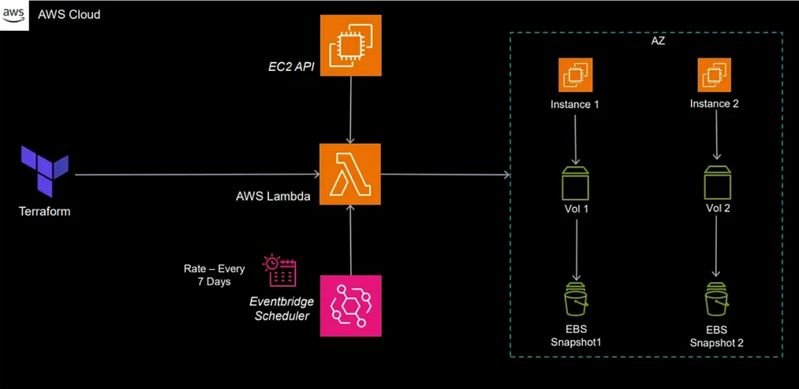


## Introduction

Managing cloud costs effectively is essential for any organization using AWS (Amazon Web Services).
One way to optimize costs is by identifying and removing unused resources.

In this blog post, I’ll show you how to save on storage costs by detecting and deleting stale EBS 
(Elastic Block Store) snapshots.

EBS snapshots are backups of your EBS volumes, but they can become orphaned when instances are
terminated or volumes are deleted. These unused snapshots take up space and incur unnecessary costs.

We’ll create a Lambda function that automatically finds and deletes these stale snapshots, helping
you manage your AWS expenses more efficiently.

Whether you’re new to AWS or an experienced user, this guide will help you automate cost-saving measures 
in your cloud environment.
Prerequisites

Before you start with the project, ensure you have the following prerequisites in place:

    AWS Account: With permissions to manage Lambda, EBS snapshots, and EC2 instances.
    AWS CLI: Installed and configured on your machine.
    Basic IAM Understanding: To create roles and custom policies.
    Basic AWS Lambda Knowledge: To create and deploy the function.
    Python Knowledge: Since the Lambda function will be in Python.
    Boto3 Library: Familiarity, as it will be used for AWS service interactions.

Ensure these prerequisites are met to follow along effectively.


## Create an EC2 Instance

This instance will serve as a resource to interact with during the setup of our Lambda function.

Note that this step can also be automated using Terraform, but for the sake of simplicity, 
we will do it manually here.

Here is a detailed step-by-step guide to creating an EC2 instance:
      Log into AWS Management Console:


1. Navigate to the AWS Management Console.
    Sign in with your AWS credentials.

2. Open the EC2 Dashboard:

    In the AWS Management Console, search for “EC2” in the search bar.
    Select “EC2” from the list of services.

3. Launch Instance:

    Click the “Launch Instance” button on the EC2 Dashboard.

4. Add Tags:

    (Optional) Add tags to your instance for easier identification.

5. Choose an Amazon Machine Image (AMI):

    Select an appropriate AMI for your needs. For this example, you can choose “Ubuntu”.

6. Choose an Instance Type:

    Select an instance type. For most use cases, the “t2.micro” instance type is sufficient and is free tier eligible.

7. Select a Key Pair:

    Select an existing key pair or create a new key pair to securely access your instance.
    Download the key pair file (.pem) and keep it safe. You cannot download it again after it is created.

8. Configure Instance Details:

    Optionally, configure instance details such as network settings, subnets, IAM role, etc. You can leave these settings as default for now.

9. Configure Security Group:

    Create a new security group or select an existing one.
    Ensure that you have rules allowing SSH access (port 22) from your IP address.

10. Add Storage:

    The default storage settings should be sufficient.
    You can adjust the size if needed.

11. Review and Launch:

    Review your instance configuration.
    Click “Launch” to proceed.


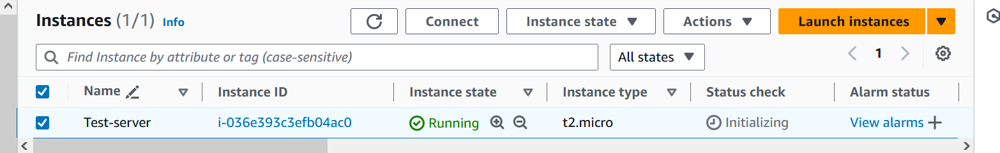

<pre>
    use Mobaxterm to ssh into your instance > click on sessions > New Sessions >
SSH > fill in the IP address of your instance > username (e.g ubuntu)
Advanced settings > private key (select the one you downloaded or have been using)
click ok (now you are in)
</pre>


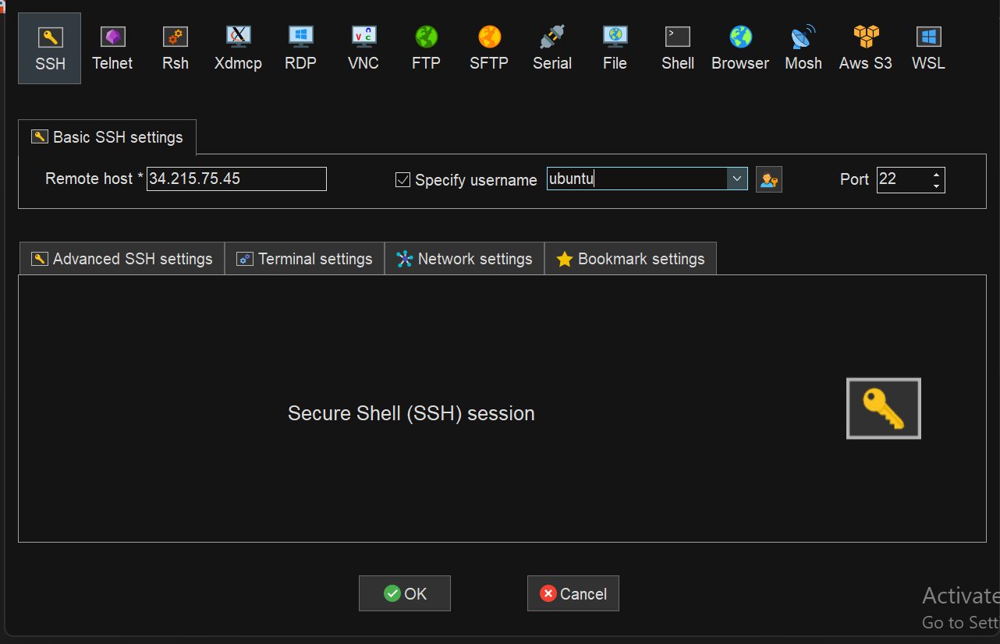


<pre>
    Next you have to create an IAM user
Go to IAM > Users > create user > download user credentials > create access keys
download access keys 
in your command line interface "aws configure" > then install it > fill in the 
Access key and Secret access keys
</pre>


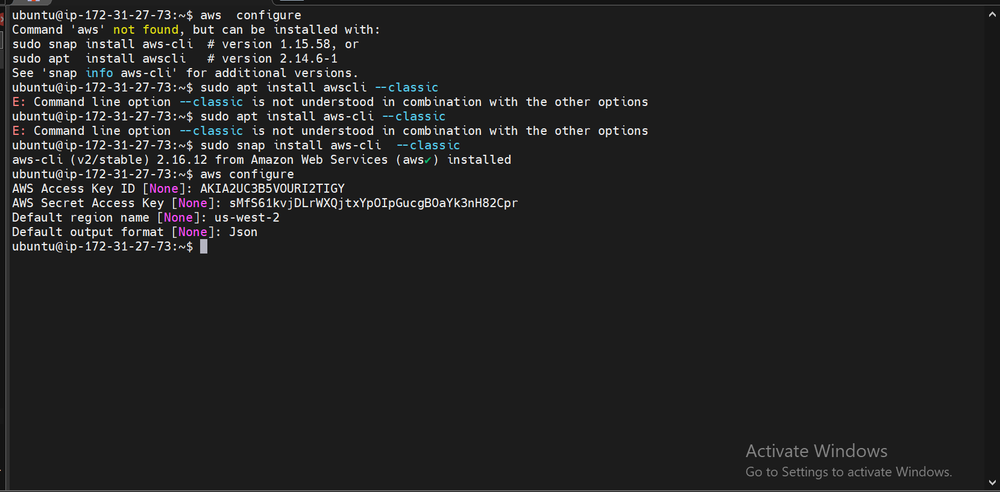


## Verify the Volume

<pre>
    Navigate to the created EC2 Instance under the “storage” section.
    This will open the details page for the volume, where you can see information 
    like size, state, and type.
    Notice that this volume was automatically created during the instance setup 
    process and is used as the root volume for your EC2 instance. 
</pre>    


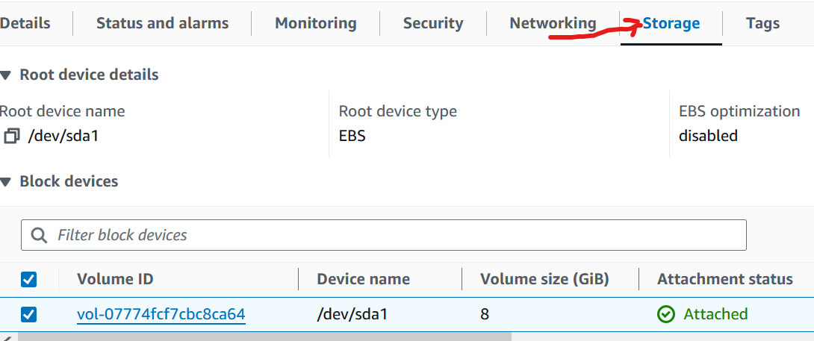


### Creating Snapshots of the Volume
<pre>
    Currently we don’t have any snapshots available for our instance.

To confirm this navigate to the EC2 Dashboard by searching for “EC2” 
in the services menu.

Find the “Snapshots” section in the left-hand menu and click on it.
</pre>


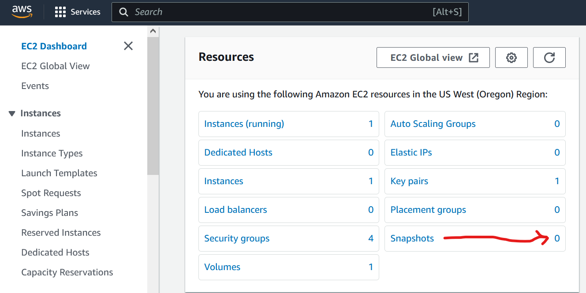


<pre>To create a snapshot of the instance click on the “Create Snapshot” button</pre>


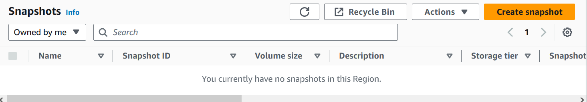


<pre>Choose the EBS volume for which you want to create a snapshot from the dropdown menu.
Optionally, add a description for the snapshot to provide more context</pre>


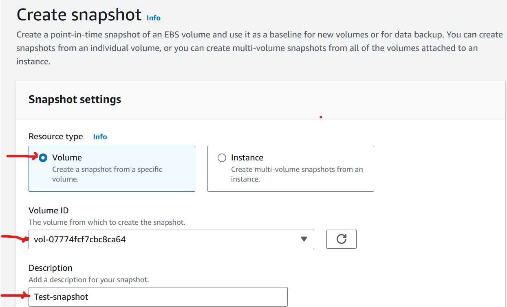


   <pre>Double-check the details you’ve entered to ensure accuracy.
    Once you’re satisfied, click on the “Create Snapshot” button to initiate the snapshot creation process.</pre> 


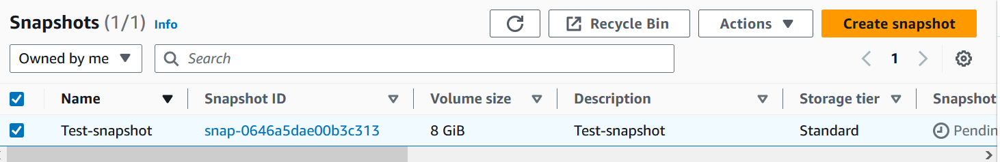


## AWS Lambda

Creating an AWS Lambda function allows you to execute code in response to
events without provisioning or managing servers.

In our project, we aim to automate the identification and deletion of stale
EBS snapshots using an AWS Lambda function.

Here’s how you can create this Lambda function using the AWS Management Console:

    Log into AWS Management Console:

    Navigate to the AWS Management Console.
    Sign in with your AWS credentials.

2. Open the Lambda Dashboard:

    In the AWS Management Console, search for “Lambda” in the services.
    Select “Lambda” from the list of services.

3. Click on “Create function”:

    On the Lambda Dashboard, click on the orange “Create function” button.


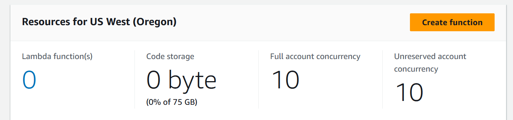


<pre>4. Choose Authoring Method:

    Select “Author from scratch” to create a new Lambda function from scratch.

5. Configure Basic Information:

    Provide a meaningful name for your Lambda function.
    Select the runtime environment. Since we’re using Python, choose “Python 3.12”.
</pre>


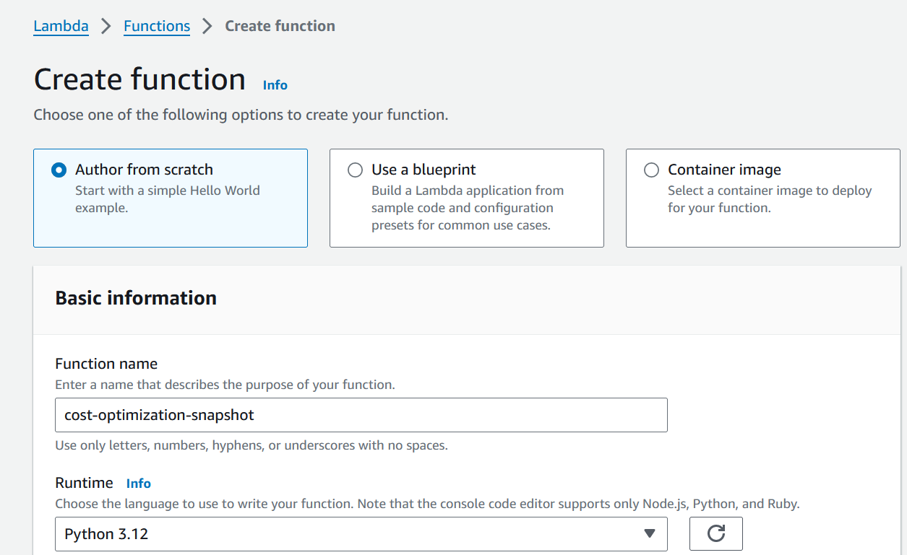


<pre>Click on “Create function” to proceed.</pre>


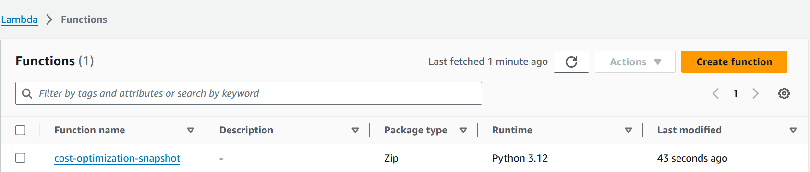


## Edit Configuration

Navigate to the “configuration tab” of the created Lambda function and click “Edit”.


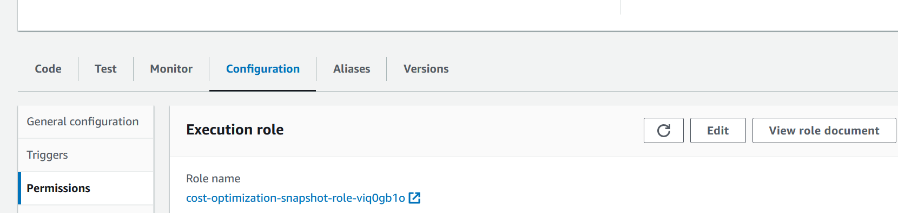


<pre>    Look for the section where you can adjust the function timeout.
    By default, the timeout is set to “3 seconds”. Change this to “10 seconds”.
    This value represents the maximum amount of time (in seconds) that Lambda will allow the function to run before terminating it.
    It is good practice to keep the execution time as small as possible since AWS will charge you using this as one of the parameters.
    Click “Save” to apply the changes.</pre>


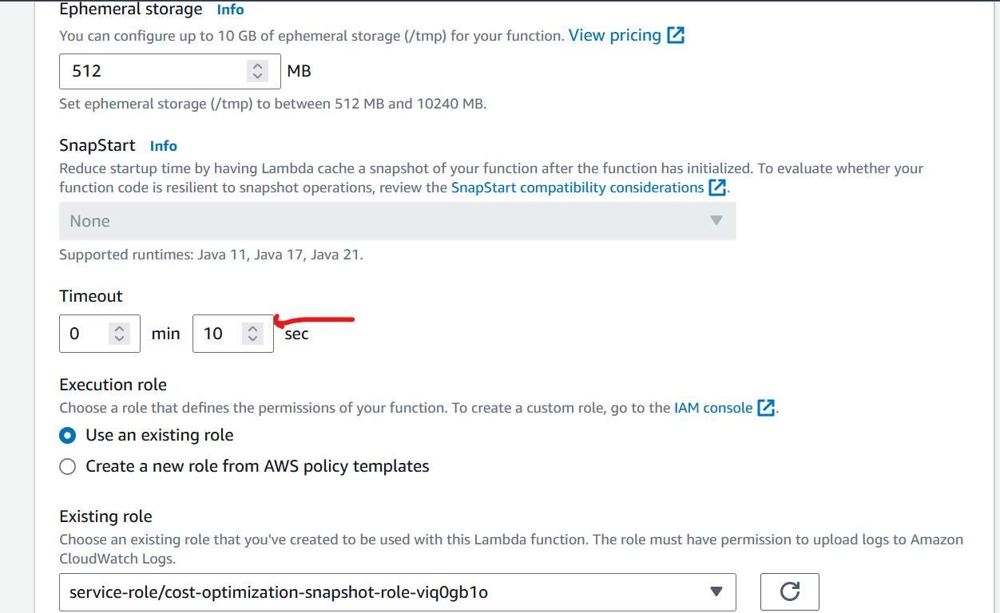


## IAM Role

In our project, the Lambda function is central to optimizing AWS costs by identifying and 
deleting stale EBS snapshots.

To accomplish this, it requires specific permissions. These include the ability to describe 
and delete snapshots, as well as to describe volumes and instances.

Roles are used to delegate access to AWS resources securely, without the need to share long-term
credentials like access keys.

To achieve this follow these step by step guide below:

    In the Lambda function details page, click on the “Configuration” tab.
    Scroll down to the “Permissions” section to expand it.
    Click on the execution role link to open the IAM role configuration in a new tab.


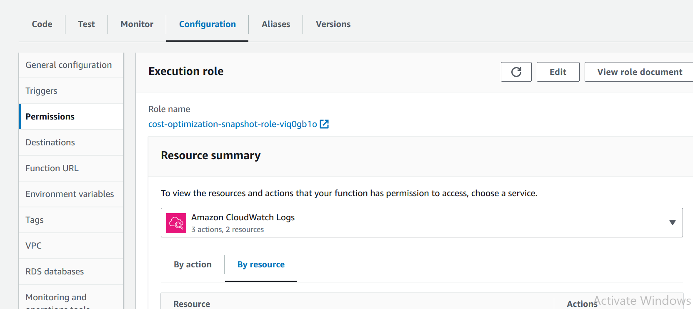


    In the new tab that opens, you’ll be directed to the IAM Console with the details of the
    IAM role associated with your Lambda function.
    Scroll down to the “Permissions” section of the IAM role details page.
    Click on the “Add inline policy” button to create a new inline policy.


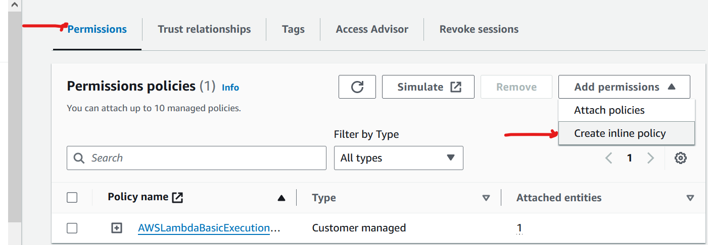


    Choose services as EC2 filter permissions.
    Search “Snapshot” and add these options “DescribeSnapshots”, “Delete Snapshots”.
    Also add these permissions as well “Describe Volume”, and “Describe Instances”.


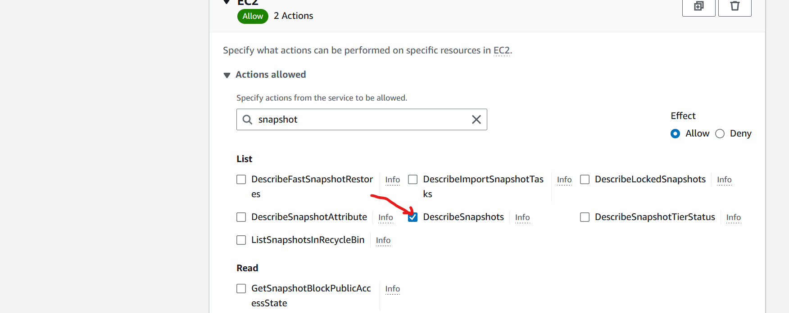


Under the Resources section select “All”.

Click the “Next” button.


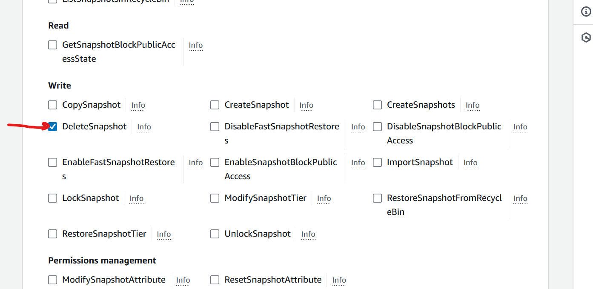


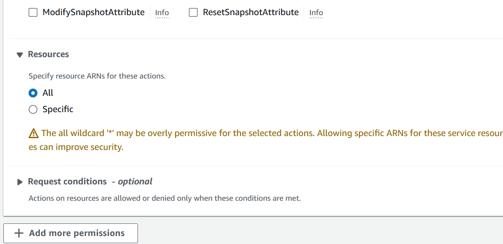


Give the name of the policy then click the “Create Policy” button.


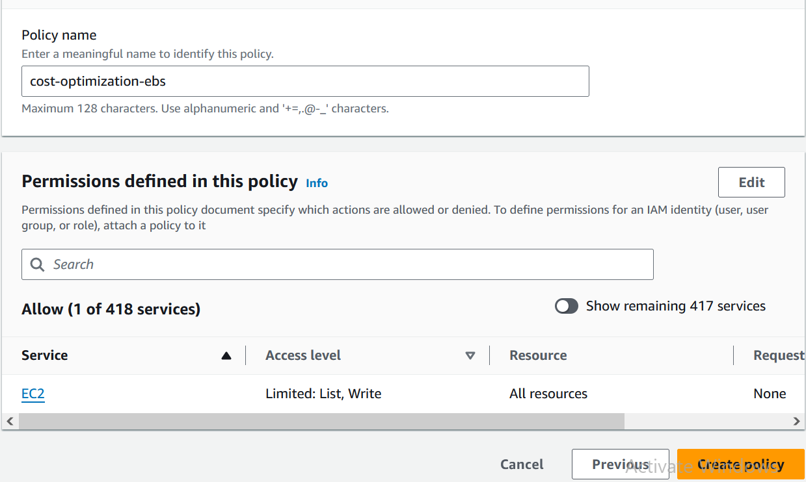


Make sure that the created policy is attached to the existing role.


Our Lambda function, powered by Boto3, automates the identification and deletion
of stale EBS snapshots. Key features include:

    Snapshot Retrieval: Fetching owned EBS snapshots and active EC2 instances.
    Stale Snapshot Detection: Identifying unattached snapshots and checking
    volume-attachment status.
    Exception Handling: Ensuring robustness with error management.
    Cost Optimization: Efficiently managing resources to minimize storage costs.


## Testing the Lambda Function

To simulate a real-world scenario, delete the existing EC2 instance.

When an EC2 instance is deleted, AWS automatically removes the attached EBS volume as shown below.

However, any EBS snapshots associated with that volume remain in storage, even though they are no longer needed.


```
import boto3

def lambda_handler(event, context):
    ec2 = boto3.client('ec2')

    # Get all EBS snapshots
    response = ec2.describe_snapshots(OwnerIds=['self'])

    # Get all active EC2 instance IDs
    instances_response = ec2.describe_instances(Filters=[{'Name': 'instance-state-name', 'Values': ['running']}])
    active_instance_ids = set()

    for reservation in instances_response['Reservations']:
        for instance in reservation['Instances']:
            active_instance_ids.add(instance['InstanceId'])

    # Iterate through each snapshot and delete if it's not attached to any volume or the volume is not attached to a running instance
    for snapshot in response['Snapshots']:
        snapshot_id = snapshot['SnapshotId']
        volume_id = snapshot.get('VolumeId')

        if not volume_id:
            # Delete the snapshot if it's not attached to any volume
            ec2.delete_snapshot(SnapshotId=snapshot_id)
            print(f"Deleted EBS snapshot {snapshot_id} as it was not attached to any volume.")
        else:
            # Check if the volume still exists
            try:
                volume_response = ec2.describe_volumes(VolumeIds=[volume_id])
                if not volume_response['Volumes'][0]['Attachments']:
                    ec2.delete_snapshot(SnapshotId=snapshot_id)
                    print(f"Deleted EBS snapshot {snapshot_id} as it was taken from a volume not attached to any running instance.")
            except ec2.exceptions.ClientError as e:
                if e.response['Error']['Code'] == 'InvalidVolume.NotFound':
                    # The volume associated with the snapshot is not found (it might have been deleted)
                    ec2.delete_snapshot(SnapshotId=snapshot_id)
                    print(f"Deleted EBS snapshot {snapshot_id} as its associated volume was not found.")
```


This script is pivotal in our AWS cost optimization strategy, showcasing
the effectiveness of serverless computing for streamlining operations.


